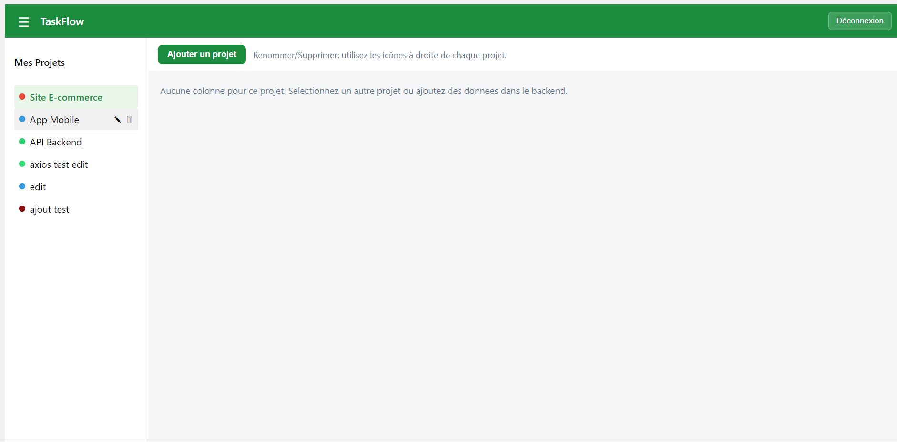

# TaskFlow - Avancement TD1 a TD5

Ce README sert de trace de progression par TD, avec un etat final clair avant livraison.

## 1. TD2 - Authentification (socle)

### Objectif

- Mettre en place le flux login/logout.
- Proteger l'acces aux pages privees.

### Points verifies

- Login utilisateur via backend JSON Server (`/users`).
- Redirection apres connexion.
- Logout fonctionnel.
- Routes privees protegees.

---

## 2. TD3 - Routing + CRUD projets

### Objectif

# TaskFlow - Objectifs par TD

## 1. TD2 - Authentification

### Objectif

- Mettre en place le flux login/logout.
- Proteger l'acces aux pages privees.

## 2. TD3 - Routing + CRUD projets

### Objectif

- Mettre en place la navigation applicative.
- Implementer le CRUD principal sur les projets.

## 3. TD4 - Couche UI

### Objectif

- Clarifier et structurer l'interface sans casser la logique metier.

## 4. TD5 - Version finale

### Objectif

- Centraliser l'authentification avec Redux Toolkit.
- Ajouter un token JWT simule.
- Injecter automatiquement le token dans les requetes API.
- Stabiliser le rendu et optimiser les performances.

## 5. Capture d'ecran - Version finale

